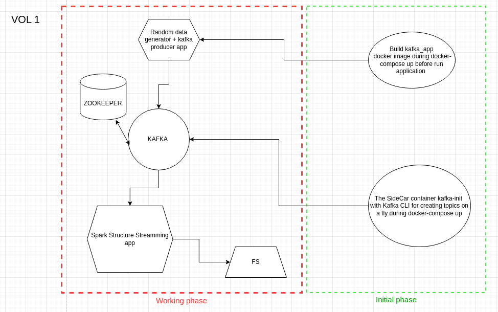

# Bigdata challenge

## Project Overview

This project is a technical assessment that involves creating
a small data pipeline to process both streaming and non-streaming data, ultimately storing to the file system.
High-level schema:



- **Producer**: generates random sequence of records and sends messages to a Kafka topic.
- **Consumer**: consumes messages from the Kafka topic, enrich it with batch dataset, aggregate and ingest to the file system .

All components including the Kafka server and Zookeeper are fully containerized using Docker.

## Project Structure

```bash
├── data
│   ├── campaigns_dict
│       └── campaigns 1.csv   # Initial data source for batch enrichment
├── diagram.drawio
├── docker-compose.yaml       # Docker Compose for Kafka, Zookeeper, and app containers
├── Dockerfile                # Dockerfile for kafka_app container
├── jars                # Additional jar files to add in classpath
├── kafka_app       # Scala/Spark application including producer and consumer instances
│   ├── pom.xml
│   └── src         # Source code
├── README.md       # Project documentation
|── .env            # Main file to manage configuration of docker-compose
```

## Setup Guide

### 1. Clone the Repository

```bash
git clone https://github.com/toshhorosh/bigdata_challenge.git
cd bigdata_challenge
```

### 2. Run Docker Compose

Start Kafka, Zookeeper, Producer, and Consumer containers by running the following command:

```bash
docker-compose up -d
```

This will start the following services:

- Zookeeper
- Kafka broker
- A sidecar container (*kafka-init*) to create the required Kafka topic
- Both consumer and producer instances – note that the image build process begins before they run, which may take some time

Check the status of the containers with:

```bash
docker-compose ps
```

### 3. Running Producer

The producer application will start sending messages automatically after running the containers. You can monitor the logs:

```bash
docker logs kafka_producer
```

### 4. Running Consumer

The consumer application will listen to the Kafka topic and display the consumed messages. You can also check the consumer logs:

```bash
docker logs kafka_consumer
```

## Result of pipeline

File structure of report:
```bash
├── data
│   └── views_report
│       ├── network_id=1
│       │   ├── minute_timestamp=%7B2024-09-13 06%3A49%3A00, 2024-09-13 06%3A50%3A00}
│       │   │   ├── part-00114-67bacece-e2a1-4020-9eb7-6f6efbce0de7.c000.snappy.parquet
│       │   │   └── part-00156-70d72f46-cb74-4e01-ace0-07bebc84c630.c000.snappy.parquet
│       │   ├── minute_timestamp=%7B2024-09-13 06%3A50%3A00, 2024-09-13 06%3A51%3A00}
│       │   │   ├── part-00000-269c61d1-9215-4da6-a165-72cd55e367dd.c000.snappy.parquet
│       │   │   └── part-00176-15f3a9cc-5a63-4400-a403-c99c8687f576.c000.snappy.parquet
│       │   ├── minute_timestamp=%7B2024-09-13 06%3A51%3A00, 2024-09-13 06%3A52%3A00}
│       │   │   └── part-00092-8b5ee3cd-4a7e-4499-a16e-6eaa8741deb9.c000.snappy.parquet
...
```

Sample result data:
```bash
scala> spark.read.parquet("file://data/views_report/network_id=4").show(5, false)
+-----------+------------------+-----------+------------------------------------------+
|campaign_id|avg_duration      |total_count|minute_timestamp                          |
+-----------+------------------+-----------+------------------------------------------+
|110        |49.666666666666664|3          |{2024-09-13 06:54:00, 2024-09-13 06:55:00}|
|130        |80.0              |1          |{2024-09-13 06:57:00, 2024-09-13 06:58:00}|
|100        |46.0              |1          |{2024-09-13 06:58:00, 2024-09-13 06:59:00}|
|140        |25.0              |1          |{2024-09-13 06:55:00, 2024-09-13 06:56:00}|
|110        |96.0              |1          |{2024-09-13 06:55:00, 2024-09-13 06:56:00}|
+-----------+------------------+-----------+------------------------------------------+
only showing top 5 rows

```

## Clean Up

After testing, you can stop the containers and remove the Docker volumes:

```bash
docker-compose down -v
```

This command will stop the containers and remove the persistent volumes.

## TODO
- add BI application container for visualization the result
- fix values of minute_timestamp column and partition key
